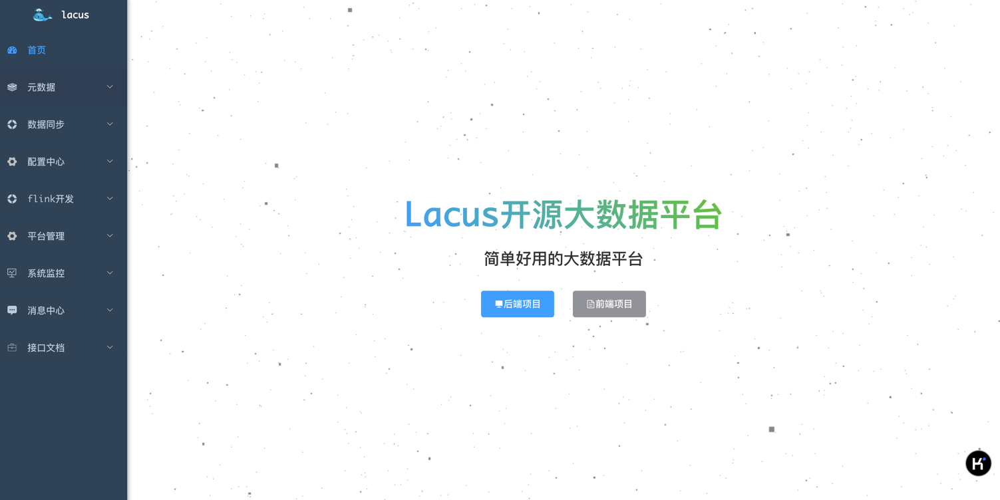
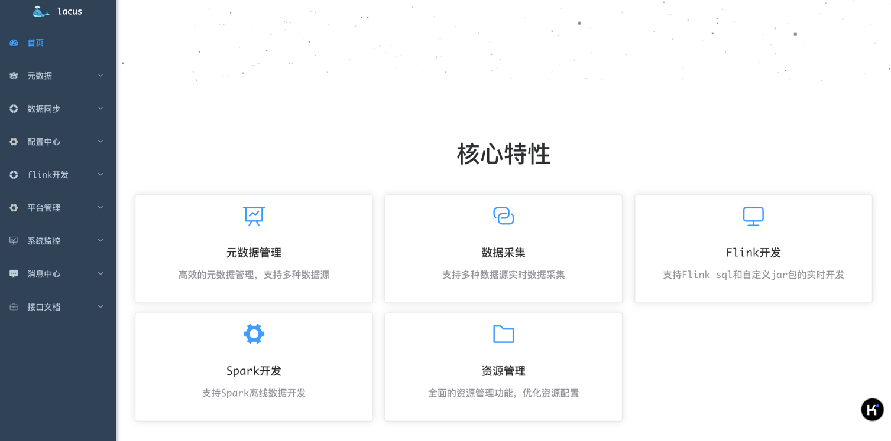
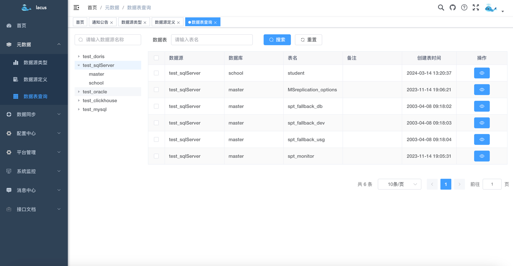
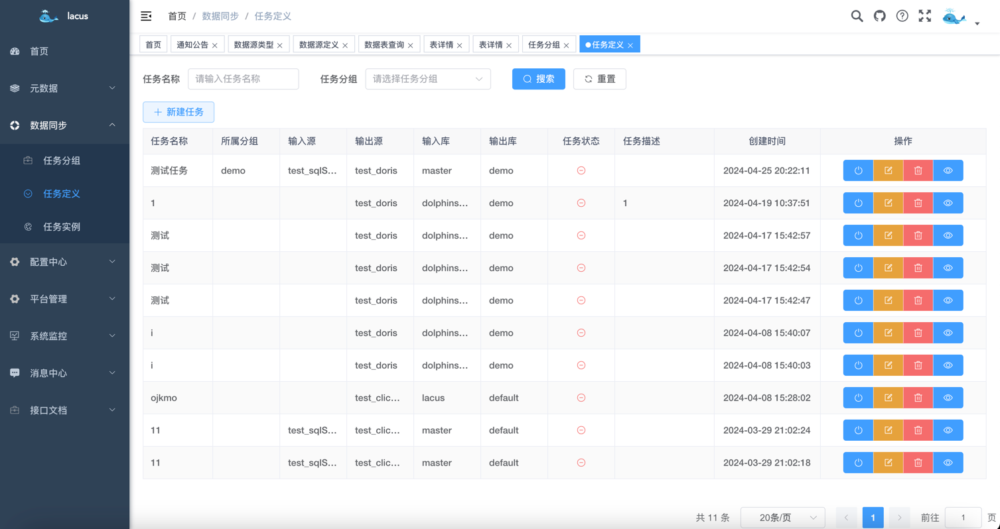
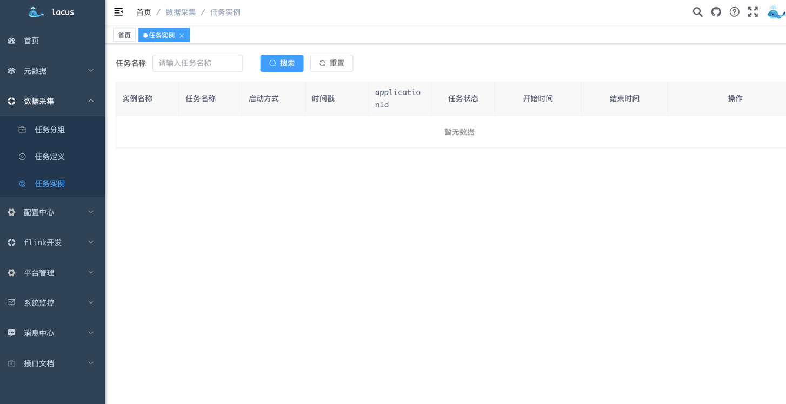
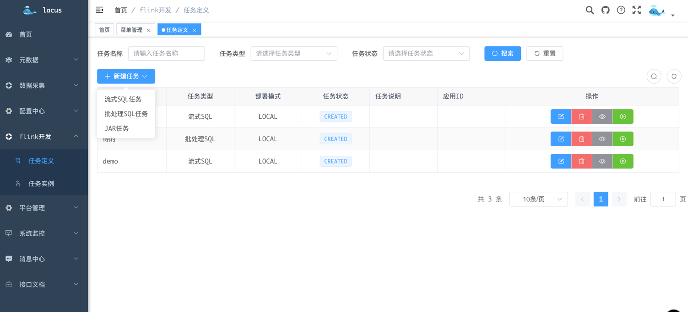
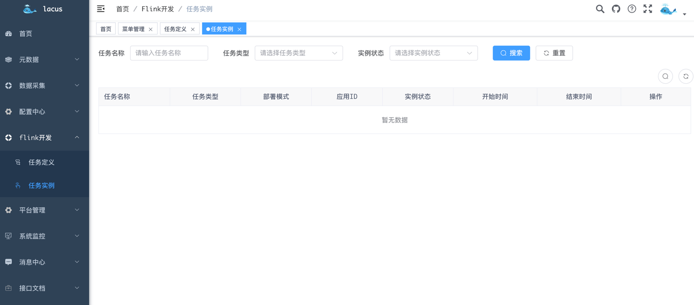
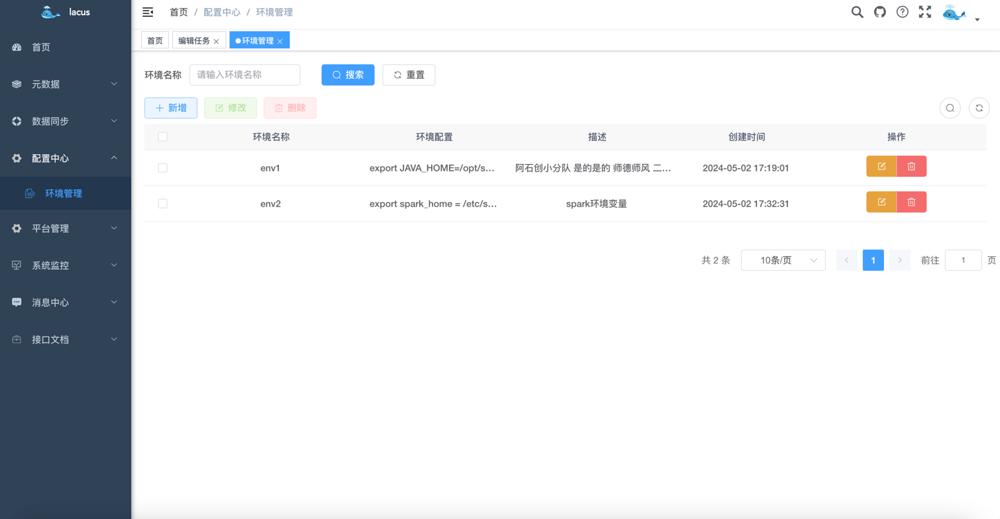
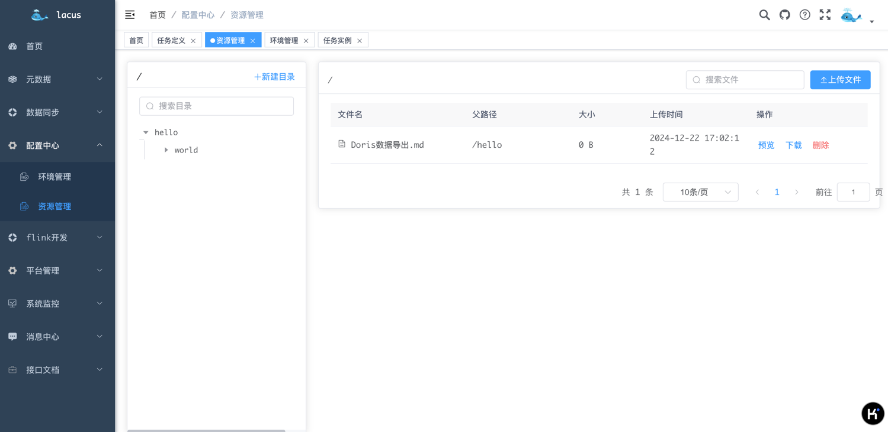

<p align="center">
  
  
  
   
 </p>
<h1 align="center" style="margin: 30px 0 30px; font-weight: bold;">Lacus v1.0.0</h1>
<h4 align="center">简单好用的开源大数据平台</h4>
<p align="center">
</p>

## 平台简介

- Lacus是一个开源大数据平台项目，主要解决大数据采集、存储、分析与计算问题，主要包括元数据、数据采集、Flink开发，Spark开发，以及资源管理。
- 如果你正在调研一款轻量级的大数据平台，那么这个项目很可能值得你去花点时间研究一下。
- 如果你热爱开源，喜欢折腾，并且对大数据感兴趣，欢迎加入这个项目，或者联系作者加入相关讨论群，交流大数据技术。
- 如果觉得对你有帮助，别忘了顺手点个 **⭐️star⭐️** 哦，你的认可对我们非常重要！！！

## 如何使用
### 一、系统截图
- 登录

- 首页


- 元数据-数据源类型

- 元数据-数据源定义

- 元数据-数据表查询

- 数据采集-任务分组

- 数据采集-任务定义

- 数据采集-任务实例

- flink开发-任务定义


- flink开发-任务实例

- 配置中心-环境管理

- 配置中心-资源管理


### 二、开发环境

- JDK
- Mysql
- Redis
- kafka
- flink
- flinkCDC
- yarn
- hadoop

### 三、技术栈

| 技术             | 说明              | 版本     |
|----------------|-----------------|--------|
| `springboot`   | Java web 项目必备框架 | 2.7    |
| `druid`        | 数据库连接池          | 1.2.8  |
| `mybatis-plus` | 数据库框架           | 3.5.2  |
| `kafka`        | 消息队列            | 2.1.1  |
| `flink`        | flink框架         | 1.16.2 |
| `flink-cdc`    | cdc connector   | 2.3.0  |
| `yarn`         | 资源调度框架          | 3.3.6  |
| `hdfs`         | 主要提供hdfs存储      | 3.3.6  |
| `vue`          | 前端框架            | 2.x    |

### 四、快速开始

#### 1. 前置准备

- 项目代码下载
```
前端项目代码：git clone https://github.com/eyesmoons/lacus
后端项目代码：git clone https://github.com/eyesmoons/lacus-ui
```
- 安装 Mysql
- 安装 Redis
- 安装 kafka
- 安装 hadoop
#### 2. flink 资源准备
- hdfs 中上传`flink 1.16.2 `所需的jar包，目录为：`/flink/libs`；
- flink配置文件目录：`/flink/conf`；
- flink 任务所需的 jar 包目录为：`/flink/jobs/flink-jobs.jar`，此 jar 包由`lacus-rtc-engine`项目打包而来
目录结构如下所示。

**如果嫌麻烦，不想一个一个的去寻找相关 jar 包，我将 flink 1.16.2 所有资源及配置文件放到了我的百度网盘中了。**

**微信关注"毛毛小妖的笔记"公众号，公众号回复关键字"lacus"，即可获得专属网盘链接和密码。**

#### 3. 后端启动
```
- 生成所需的数据库表
找到后端项目根目录下的 sql 目录中的 lacus.sql 脚本文件，导入到你新建的数据库中。

- 修改配置文件：lacus-core
application-dev.yml：修改 Mysql 数据库以及 Redis 信息。
application-basic.yml：修改 yarn、hdfs 和 kafka 等信息。

- 项目编译
在根目录执行 mvn install

- 启动项目
找到lacus-admin模块中的 LacusApplication 启动类，直接启动即可。

```
#### 4. 前端启动
```
- cd lacus-ui
- npm install
- npm run dev
```

## 打包部署
### 1. 打包
```shell
mvn clean package -Dmaven.test.skip=true
```
打包完生成的文件为：lacus-dist/target/lacus-dist-1.0.0-all.tar.gz
### 2. 上传
将打包之后的jar包上传至服务器：lacus-dist-1.0.0-all.tar.gz
### 3. 解压
```
tar -zxvf lacus-dist-1.0.0-all.tar.gz
```
解压完的目录为：
```
lacus-dist-1.0.0
├── bin -- 启动脚本
├── boot -- 启动jar包
├── conf -- 配置文件
├── doc -- 文档
├── docker -- docker相关文档
├── lib -- 依赖jar包
└── sql -- 项目用到的sql脚本
```
### 4. 修改配置文件
修改解压完的conf目录下的配置文件，可根据需要修改
### 5. 启动
```shell
cd lacus-dist-1.0.0/bin
sh lacus-admin.sh start
```
### 6. 其他命令
```shell
# 查看启动状态
sh lacus-admin.sh status
# 停止
sh lacus-admin.sh stop
# 重启
sh lacus-admin.sh restart
```
## 系统功能

| 功能    | 描述                 | 状态    |
|-------|--------------------|-------|
| 元数据管理 | 根据源库表管理所有元数据信息     | 已完成   |
| 数据服务  | 通过API接口,对外提供获取数据能力 | 前端待开发 |
| 数据同步  | 通过可视化配置，一键部署采集任务   | 前端待完善 |
| 数据开发  | 通过可视化配置，在线提交数据开发任务 | 开发中   |

## 项目结构

``` shell
lacus
├── lacus-admin  -- api接口模块
├── lacus-common -- 公共模块
├── lacus-core  -- 核心基础模块
├── lacus-dao  -- 数据库交互模块
├── lacus-dist  -- 打包模块
├── lacus-domain  -- 业务领域模块
├── lacus-service  -- 服务层
├── lacus-rtc-engine  -- 实时采集引擎
└── sql  -- sql脚本
```

## 注意事项
- idea会自动将.properties文件的编码设置为ISO-8859-1,请在Settings > Editor > File Encodings > Properties Files > 设置为UTF-8
- 如需要生成新的表，请使用CodeGenerator类进行生成。
  - 填入数据库地址，账号密码，库名。然后填入所需的表名执行代码即可。

欢迎关注以下公众号，留言或公众号回复"交流"加入技术交流群，一起学习。

