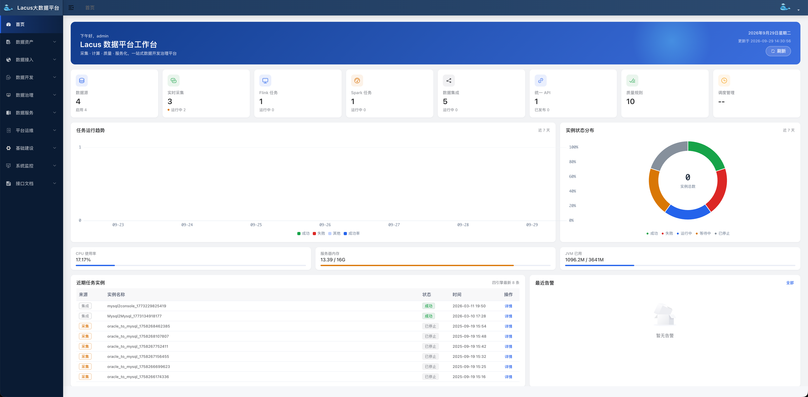

# Lacus 开源大数据平台

## 项目背景

在企业数字化进程中，数据体量与数据源种类持续增多，典型的数据工程链路往往涉及采集、同步、实时计算、离线计算、元数据治理、数据服务等多个环节。传统做法通常组合多个独立工具（Sqoop / DataX / Flink / Spark / 自研服务），带来以下痛点：

- **工具链碎片化**：每个环节一个独立系统，运维成本高、账户权限分散、监控不统一。
- **上手门槛高**：业务人员要同时理解 Flink SQL、Spark、CDC、连接器配置等多种技术栈。
- **重复开发**：数据同步、数据 API、校验逻辑在每个项目中重复建设。
- **缺乏统一元数据**：数据源、表结构、任务血缘分散在不同系统，难以形成全局视图。

Lacus 是一个开源、一体化、企业级大数据集成与处理平台，核心目标是把大数据的「采集、存储、计算、服务、治理」收敛到一个统一平台，通过可视化 + 配置化的方式，让大数据任务的开发与运维像搭积木一样简单。

---

## Star History

<a href="https://www.star-history.com/?repos=eyesmoons%2Flacus&type=timeline&legend=top-left">
 <picture>
   <source media="(prefers-color-scheme: dark)" srcset="https://api.star-history.com/chart?repos=eyesmoons/lacus&type=date&theme=dark&legend=top-left" />
   <source media="(prefers-color-scheme: light)" srcset="https://api.star-history.com/chart?repos=eyesmoons/lacus&type=date&legend=top-left" />
   
 </picture>
</a>

---

## 系统功能全景

Lacus 围绕「数据全链路」提供以下核心模块：

| 模块 | 路径入口 | 核心能力 |
|------|---------|---------|
| 元数据管理 | `/metadata/*` | 数据源管理、表结构浏览、字段/统计信息、数据源插件管理 |
| 数据集成 | `/dig/*` | 基于 SeaTunnel 的可视化拖拽设计器 + 专家 JSON 模式，Source/Transform/Sink 组件化编排 |
| 数据同步 | `/datasync/*` | 传统表级同步、字段映射、全量/增量策略、任务分组 |
| Flink 开发 | `/flink/*` | 流式 SQL、批处理 SQL、自定义 JAR、任务实例监控、Flink Web UI 跳转 |
| Spark 开发 | `/spark/*` | 批处理 SQL、自定义 JAR、Hive 读写、实例监控 |
| 统一 API | `/oneapi/*` | 通过 SQL 快速生成 REST API，支持参数化、在线测试、SQL 解析 |
| 数据质量 | `/dataquality/*` | 基于 Spark 的规则管理、执行记录、多维度质量校验 |
| 系统管理 | `/system/*`、`/monitor/*` | 用户/角色/菜单/部门/岗位、数据权限、服务器/缓存/在线用户/日志/Druid 监控 |

---

## 应用场景

### 实时数据同步与入湖

> 业务 DB（MySQL/Oracle）变更需要实时同步到 Kafka / Hive / Doris。

1. 元数据模块注册数据源
2. 数据集成设计器拖拽「MySQL CDC Source → Kafka Sink」
3. 配置 binlog 订阅、topic、序列化格式，提交运行
4. 通过任务实例监控延迟、记录数、错误日志

### 离线数仓 ETL

> 每日 T+1 从 Hive 源表聚合计算到目标库。

1. 进入 Spark 开发 → 新建批处理 SQL
2. 编写 Spark SQL（支持 `CREATE TEMPORARY VIEW`、`INSERT OVERWRITE`）
3. 配置 executor 数量、内存等资源参数，提交到 YARN
4. 实例模块查看运行状态与耗时

### 实时流计算

> Kafka 用户事件流实时写入 ClickHouse 供 BI 查询。

1. Flink 开发 → 新建 STREAMING SQL
2. 定义 Source Table（Kafka + JSON）与 Sink Table（JDBC/ClickHouse）
3. 编写 `INSERT INTO sink SELECT ... FROM source`
4. 配置并行度、Checkpoint，提交到 Flink 集群

### 数据服务化（Data as a Service）

> 业务方需要「用户画像」「订单统计」等数据，但不想直连数据库。

1. 统一 API → 新建 API，编写 SQL，定义参数
2. 平台自动生成 REST 接口
3. 业务方通过 `GET /one/api/...` 调用，支持在线测试与参数校验

### 数据质量监控

> 对核心表做空值、唯一性、范围校验。

1. 数据质量 → 规则管理，配置校验规则
2. 基于 Spark 执行质量任务
3. 执行记录查看通过/失败明细

### 元数据治理与数据盘点

> 管理上百个数据源、数千张表，需要统一浏览与血缘。

1. 元数据 → 数据源管理，注册各类数据源
2. 表结构浏览：字段、类型、注释、行数、大小
3. 数据源类型管理：统一维护驱动与插件

---

## 技术架构

### 整体架构（前后端分离 + 插件化）

- **前端**：lacus-ui（Vue 3 + Element Plus + Vite）
- **后端**：lacus（Spring Boot 2.7 + Flink + Spark + Kafka + FlinkCDC）
- **运行环境**：JDK 1.8+、MySQL、Redis、Kafka、Hadoop/YARN、Flink 1.16+、Spark 2.4/3.4

### 前端技术栈（lacus-ui）

| 维度 | 技术选型 | 说明 |
|------|---------|------|
| 框架 | Vue 3.2（Composition API + `<script setup>`） | 响应式、性能优 |
| UI 库 | Element Plus 2.2 | 企业级组件、中文 locale |
| 构建 | Vite 2.9 | 极速 HMR、按需构建 |
| 状态 | Vuex 4 | app / user / tagsView / permission / settings 模块 |
| 路由 | Vue Router 4（History 模式） | 动态路由、菜单权限 |
| 可视化 | AntV X6 2.18 | 数据集成画布（节点/连线/拖拽） |
| 编辑器 | Monaco Editor 0.34 | SQL / JSON 专家模式 |
| 微前端 | Qiankun 2.10 | 子系统微前端接入 |
| 3D/动画 | Three.js + AOS | 首页粒子背景与滚动动画 |
| 工具 | ECharts、Fuse.js（模糊搜索）、jsencrypt（RSA 登录） | — |
| 规范 | ESLint + Prettier | 代码风格统一 |

### 后端技术栈（lacus）

| 维度 | 技术选型 | 说明 |
|------|---------|------|
| 基础 | Java 8 + Spring Boot 2.7 | 稳定、生态成熟 |
| ORM | MyBatis-Plus 3.5 | 高效 CRUD |
| 连接池 | Druid 1.2.8 | SQL 监控 |
| 消息 | Kafka 3.6 | 实时数据源 |
| 流处理 | Flink 1.16 + FlinkCDC 2.3 | 实时采集与流 SQL |
| 批处理 | Spark 2.4 / 3.4 | 离线计算 |
| 存储 | Hadoop 2.8、HDFS、Hive、Doris、Redis | — |
| 协调 | ZooKeeper 3.9 | 分布式协调 |
| 打包 | Maven 多模块 + lacus-dist 一键发布 | 生成 `lacus-dist-*-all.tar.gz` |

### 核心架构特征

**（1）插件化引擎（lacus-st-plugin）**

数据集成模块的核心是一个自研的轻量插件引擎，借鉴 SeaTunnel 的设计理念：

- **注解驱动**：通过 `@StComponent`、`@StField`、`@StTag` 三个注解声明插件元数据
- **SPI 加载**：利用 AutoService + 自定义 `StComponentLoader` 自动扫描 Source / Transform / Sink 插件
- **动态表单**：每个插件通过 `@StField` 描述自身配置项，后端 `FormBuilder` 自动组装 JSON Schema，前端 `DynamicForm` 动态渲染配置表单

已支持的数据源：MySQL、PostgreSQL、Oracle、SQL Server、DB2、ClickHouse、Doris、StarRocks、Kafka，以及 MySQL/Oracle CDC。

已支持的转换：Copy、FieldMapper、FieldRename、Replace、Split、SQL、Metadata。

这一设计让「新增一个数据源」只需要写一个 Java 类 + 加注解，无需改动前端或核心代码。

**（2）可视化 + 专家模式双模设计器**

- **可视化模式**：基于 AntV X6 画布，左侧组件面板 → 拖拽 Source/Transform/Sink → 连线 → 配置 → 保存/运行
- **专家模式**：Monaco Editor 直接编辑 JSON，支持语法高亮、校验、自动补全
- 两种模式实时可切换，满足不同层级用户需求

**（3）统一 API 即服务（OneAPI）**

用户编写带 `#{param}` 占位符的 SQL，平台自动解析参数并生成 REST 接口。支持 GET/POST、参数类型定义、默认值、SQL 在线解析与测试。对外暴露 `/one/api/*` 路径，可直接被第三方系统调用。

**（4）多引擎统一调度**

在一个平台内同时管理 Flink（流/批 SQL + JAR）、Spark（批 SQL + JAR）、SeaTunnel 数据集成、FlinkCDC 实时采集，统一的「任务定义 → 任务实例 → 日志 → 监控」生命周期。

**（5）企业级权限与审计**

菜单权限 + 按钮权限（`v-hasPermi`、`v-hasRole`）+ 数据权限（全部/部门/本人/自定义）。操作日志、登录日志、在线用户、Druid 连接池监控、服务器监控全覆盖。

---

## 如何使用

### 一、开发环境

- JDK 1.8+
- MySQL
- Redis
- Kafka
- Flink 1.16+
- FlinkCDC 2.3
- Hadoop/YARN
- Spark 2.4 / 3.4

### 二、快速开始

#### 1. 前置准备

```bash
# 代码下载
前端项目代码：git clone https://github.com/eyesmoons/lacus-ui
后端项目代码：git clone https://github.com/eyesmoons/lacus
docker 部署：git clone https://github.com/eyesmoons/lacus-docker
```

- 安装 MySQL
- 安装 Redis
- 安装 Kafka
- 安装 Hadoop

#### 2. Flink 资源准备

- HDFS 中上传 Flink 1.16.2 所需的 jar 包，目录为：`/rtc/libs`
- Flink 配置文件目录：`/rtc/conf`
- Flink 任务所需的 jar 包目录为：`/rtc/engine/lacus-rtc-engine.jar`，此 jar 包由 `lacus-rtc-engine` 项目打包而来

#### 3. 后端启动

```bash
# 生成所需的数据库表
# 找到后端项目根目录下的 sql 目录中的 lacus.sql 脚本文件，导入到你新建的数据库中

# 修改配置文件
# application-dev.yml：修改 MySQL 数据库以及 Redis 信息
# application-basic.yml：修改 yarn、hdfs 和 kafka 等信息

# 项目编译
mvn install

# 启动项目（找到 lacus-admin 模块中的 LacusApplication 启动类，直接启动即可）
```

#### 4. 前端启动

```bash
cd lacus-ui
npm install
npm run dev
```

---

## 打包部署

### 1. 打包

```shell
mvn clean package -Dmaven.test.skip=true
```

打包完生成的文件为：`lacus-dist/target/lacus-dist-2.0.0-all.tar.gz`

### 2. 上传

将打包后的 tar.gz 上传至服务器

### 3. 解压

```shell
tar -zxvf lacus-dist-2.0.0-all.tar.gz
```

解压完的目录结构：

```
lacus-dist-2.0.0
├── bin    -- 启动脚本
├── boot   -- 启动 jar 包
├── conf   -- 配置文件
├── doc    -- 文档
├── docker -- docker 相关文档
├── lib    -- 依赖 jar 包
└── sql    -- 项目用到的 sql 脚本
```

### 4. 修改配置文件

修改解压完的 conf 目录下的配置文件，可根据需要修改。

### 5. 启动

```shell
cd lacus-dist-2.0.0/bin
sh lacus-admin.sh start
```

### 6. 其他命令

```shell
# 查看启动状态
sh lacus-admin.sh status

# 停止
sh lacus-admin.sh stop

# 重启
sh lacus-admin.sh restart
```

---

## 项目结构

### 后端 lacus

```
lacus/
├── lacus-admin             # 启动入口 / API 网关
├── lacus-common            # 公共工具
├── lacus-core              # 核心基础
├── lacus-dao               # MyBatis-Plus 数据访问
├── lacus-domain            # 业务领域
├── lacus-service           # 服务层
├── lacus-st-plugin         # ★ 插件引擎（Source/Sink/Transform + 注解 + SPI）
├── lacus-flink-sql-app     # Flink SQL 应用
├── lacus-spark-sql-app     # Spark SQL 应用
├── lacus-one-api-app       # 统一 API 应用
├── lacus-rtc-engine        # 实时采集引擎（FlinkCDC）
├── lacus-dataquality       # 数据质量模块
├── lacus-datasource-plugin # 数据源插件
├── lacus-dist              # 一键打包模块
└── sql                     # 数据库脚本
```

### 前端 lacus-ui

```
lacus-ui/
├── src/
│   ├── api/           # 按模块划分：dig/ flink/ spark/ oneapi/ datasync/ metadata/ ...
│   ├── components/    # 通用组件：MonacoEditor / CronInput / DynamicForm / X6 画布...
│   ├── layout/        # 布局（TopNav / Sidebar / Breadcrumb）
│   ├── router/        # 路由 + 权限拦截器
│   ├── store/         # Vuex 模块
│   ├── utils/         # 请求封装、字典、日期、RSA 等
│   └── views/         # 业务页面
│       ├── dig/        # 数据集成（designer/expert/job/instance）
│       ├── flink/      # Flink 开发
│       ├── spark/      # Spark 开发
│       ├── oneapi/     # 统一 API
│       ├── datasync/   # 数据同步
│       ├── metadata/   # 元数据
│       ├── dataquality/# 数据质量
│       ├── system/     # 系统管理
│       └── monitor/    # 系统监控
├── vite/              # Vite 插件配置
├── docker/            # Docker 部署
└── package.json       # Vue 3 + Element Plus + Vite + X6 + Qiankun
```

---

## 总结

Lacus 是一个功能完整、架构清晰、可扩展性强的开源大数据平台。它通过插件化引擎 + 可视化设计器 + 双模编辑 + 统一 API 的组合，把传统上需要多套工具协作的数据工程链路收敛到一个统一平台，显著降低了大数据任务的开发、运维与治理门槛。

- **适合人群**：希望快速搭建企业级数据中台、入湖入仓、实时计算、数据服务化的团队
- **适合场景**：数据同步、实时流计算、离线 ETL、数据质量、元数据治理、数据 API 化
- **核心优势**：开源免费、插件可扩展、可视化低代码、多引擎统一、一键部署

---

**仓库地址：**

- 前端：https://github.com/eyesmoons/lacus-ui
- 后端：https://github.com/eyesmoons/lacus
